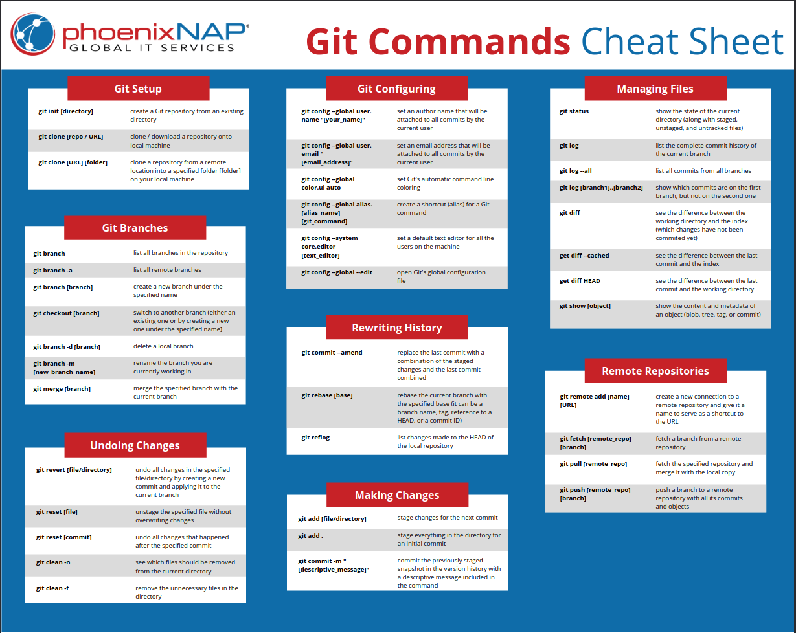

<style>
    :root {
        background-image: url("https://upload.wikimedia.org/wikipedia/de/thumb/e/ec/DHBW_Ravensburg.svg/1200px-DHBW_Ravensburg.svg.png");
        background-repeat: no-repeat;
        background-position: right top;
        background-size: 220px;
        background-origin: content-box;
    }
</style>

# Tutorium Programmierung 2
> 15.05.2025

Janens Kurzke und Fabian Bauriedl

---
## Inhalt

1. Exceptions
1. Generics und Optionals
1. Datenstrukturen
1. Big-O-Notation
1. Git

---
### Exceptions
* Fehler die während der Laufzeit auftreten
* Dienen zur Kommunikation
* Manuelles auslösen über throw
* Abfangen über catch
* Exceptions sind Klassen/ Objekte
---
### Exceptions werfen

```Java
public static void checkAge(int age) throws Exception {
    if(age < 18) {
        throw new Exception("You're to young");
    }
}
```

---
### Eigene Exceptions

```Java
public class CustomExceptions extends Exception{
    CustomExceptions(String message){
        super(message);
        System.out.println("I am a custom exception");
    }
}
```

---
### Exceptions fangen

```Java
public static void main(String[] args) {
    try {
        checkAge(17);
    } catch (ToYoungException e) {
        System.out.println("User appears to be to young");
    } catch (Exception e) {
        System.out.println("An unknown error occured");
    } finally {
        System.out.println("finished try catch block");
    }
}
```

---
### Generics
* Generische Klassen und Interfaces
* Bezieht sich auf Parameter/ Argumente
* Funktionalität unabhängig von Typen implementieren

---
### Generics Anwendung

*  Verwendung des komplexen Datentypes

```Java
public static void main(String[] args) {
    ArrayList<String> names = new ArrayList<>();
    names.add("Christian");
    names.add("Sabine");
    int len = names.size();
    names.remove(0);
}
```

---
### Generics Implementierung

```Java
public class Paar<T, U> {
    private final T firstElement;
    private final U secondElement;

    public Paar(T firstElement, U secondElement){
        this.firstElement = firstElement;
        this.secondElement = secondElement;
    }

    @Override
    public String toString(){
        return firstElement + " and " + secondElement;
    }
}
```

---
### Optionals
* Wrapper Klasse
* Vermeidung von Nullpointer Exceptions
* Zugriff auf Werte über umwege

---
### Optionals Anwendung I

```Java
Optional<String> name = Optional.of("Lindner");
if (name.isPresent()){
    System.out.println("there is a name");
}
```

---
### Optionals Anwendung II

```Java
String userInput = null;
Optional<String> userName = Optional.ofNullable(userInput);

userName.ifPresentOrElse(
    (value) -> System.out.println(value),
    () -> System.out.println("there is no name"));
```

---
## Datenstrukturen
1. Stack
1. Queue
1. List
1. Tree
1. HashMap

---
### Stack
* Stapel von Elementen
* Neue Elemente werden oben angefuegt
* Zugriff nur von oben moeglich
* Neueste Elemente zuerst --> Last in First Out
* z.B. Undo/ Redo, Browserverlauf

---
### Stack Operationen
|Return|Method|Description|
|---|---|---|
|boolean|empty()|check ob stack leer ist|
|E|peek()|gibt oberstes Objekt und behält es|
|E|pop()|gibt oberstes Objekt und entfernt es|
|E|push(E item)|fügt Objekt oben an|
|int| search(Object o)| sucht Objekt und gibt Position zurück|

---
### Stack


---
### Queue
* Warteschlange von Elementen
* Neue Elemente werden unten angefuegt
* Zugriff nur von oben moeglich
* Älteste Elemente zuerst --> First in First Out
* z.B. Datenübertragung, Warteschlangen, Schedular (Betriebssysteme)

---
### Queue Operationen
|Return|Method|Description|
|---|---|---|
|boolean|enqueue(E e)|Objekt hinten anfügen|
|E|dequeue()|Objekt vorne entfernen|
|E|peek()|gibt vorderstes Element und behält es|
|boolean|isEmpty()|check ob Queue leer ist|

---
### Queue


---
### List
* Liste von Elementen
* Standard anfügen von hinten
* Einfügen an bestimmter Stelle möglich
* Zugriff auf Elemente über Index

---
### List Operationen
|Return|Method|Description|
|---|---|---|
|int|length()|Länge der Liste|
|void|prepend(E e)|Objekt vorne anfügen|
|void|append(E e)|Objket hinten anfügen|
|boolean|insertAt(E e, int i)|Objekt bei Index einfügen|
|boolean|remove(E e)|gegebenes Objekt löschen|
|void|removeAt(int i)|Objekt an Index löschen|
|Object|get(int i)|Gibt Objekt an Index aus|

---
### Linked List


---
### Tree
* hierarchische Datenstruktur
* effiziente suche und navigation des Baums
* Daten liegen in Knoten
* Knoten sind über Kanten verbunden
* z.B. Dateisysteme

---
### Tree


---
### Tree Begriffe
* Root Node
* Child Node
* Parent Node
* Leaf Node
* Level

---
### Tree Begriffe
* Ancestor Node
* Descendant Node
* Sibling
* Neighbor
* Subtree

---
### Tree Arten
* Binary Tree
* Ternary Tree
* Quadtree
* N-Tree

---
### Binary Tree
* 0 bis 2 Child Nodes pro Parent Node
* Tree ist unsortiert

``` Java
public class Node {
    public int number;
    public Node left;
    public Node right;
}
```

---
### Binary Tree Operations
|Return|Method|Description|
|---|---|---|
|int|traverse()|Länge der Liste|
|void|insert(E e)|Objekt einfügen|
|void|delete(E e)|Objekt löschen|
|int|search(E e)|Sucht Objekt und gibt Index zurück|

---
### Binary Tree Depth First Search


---
### Binary Tree Pre-Order-Traversal


---
### Binary Tree In-Order-Traversal


---
### Binary Tree Post-Order-Traversal


---
### Binary Tree Breadth First Search


---
### Binary Search Tree
* Binary Tree mit Sortierung
* Left Child Node <= Parent Node
* Right Child Node > Parent Node

---
### Binary Search Tree Operations
|Return|Method|Description|
|---|---|---|
|int|search(E e)|Sucht Objekt im Tree und gibt Index zurück|
|void|insert(E e)|Objekt einfügen|
|void|delete(E e)|Objekt löschen|

---
### Set
* Interface
* Abbildung einer Menge

### Operationen
* Vereinigung (Union)
* Durchschnitt (Intersection)
* Differenz (Difference)

---
### HashSet Example
``` Java
public static void main(String[] args) {
    Set<Integer> numbers = new HashSet<Integer>();
    Set<Integer> otherNumders = new HashSet<Integer>();

    for (int i = 0; i < 10; i++) {
        numbers.add(i);
        //[0, 1, 2, 3, 4, 5, 6, 7, 8, 9]
        otherNumders.add(i*2);
        //[0, 16, 2, 18, 4, 6, 8, 10, 12, 14]
    }
    numbers.size(); 
    //10
    otherNumders.addAll(numbers);
    //[0, 1, 2, 3, 4, 5, 6, 7, 8, 9, 10, 12, 14, 16, 18]
    otherNumders.retainAll(numbers);
    //[0, 2, 4, 6, 8]
    otherNumders.removeAll(numbers);
    //[16, 18, 10, 12, 14]
}
```

---
### Map
* Interface
* Schlüssel-Wert-Paare
* Keine doppelten Schlüssel

---
### HashMap Example
```Java
public static void main(String[] args) {
    Map<Integer, String> idNameMap = new HashMap<Integer, String>();

    idNameMap.put(123, "Christian");
    idNameMap.put(1234, "Sabine");

    idNameMap.get(1234);
    idNameMap.size();
    idNameMap.remove(1234);
    idNameMap.containsKey(123);
    idNameMap.containsValue("Christian");
    idNameMap.keySet();     //[123]
    idNameMap.entrySet();   //[123=Christian]
    idNameMap.values();     //[Christian]
}
```

---
### Hash
* Abbildung großer Datenmenge auf kleine
* Ergebnis einer Hashfunktion
* Einwegsfunktion
* Deterministisch
* Kollisionen sind möglich (gleicher Hash bei unterschiedlicher Eingabe)

---
### HashMap insert Funktionsweise
1. Hashwert aus Schlüssel berechnen --> Index
1. Wenn kein Wert an Index --> einfügen
1. Wenn Wert an Index --> Werte vergleichen
1. Wenn Werte gleich --> alten Wert ersetzen
1. Wenn Werte ungleich --> Speicher vergrößern

---
## Big-O-Notation
* Bewertung der Speicher-Komplexität und Zeit-Komplexität
* Unterscheidung in Best-Case, Average-Case und Worst-Case
* Beschreibt wie die Speicher- und Zeit-Komplexität mit Problem skaliert
* Darstellung in Funktion O(f(n))
* n gibt die Größe des Problems an (z.B. Datenpunkte)
* Anwendbar auf Algorihmen und Datenstrukturen

---
### Big-O-Notation


---
### Big-O-Notation


---
### Big-O-Notation Sorting


---
### Big-O-Notaton Search


---
## Git
* Open Source Version Controll Software
* Verfolgung von Änderungen an Dateien, insbesondere Code
* Kolaboration an einem Projekt wird möglich
* Verwendung von lokalen und remote Repositories
* Erstellung von "Savepoints"
* Arbeit mit Branches ermöglicht Prototyping
* Standard Tool in der Softwareentwicklung

---
## Git-Workflow
1. repository initialisieren (git init)
1. Datei-Änderungen stagen/ snapshots erstellen (git add)
1. Datei-Änderungen commiten (git commit -m"")

## Git-Remote-Repository - GitHub
* Repository wird in der Cloud gesichert
* Kolaboration wird möglich

---
## Beispiel Git-Workflow
1. GitHub Repository erstellen
1. "gh clone" befehl kopieren (GitHub CLI wird benötigt)
1. .gitignore beeinhaltet Dateiendungen, die nicht von Version Controll erfasst werden sollen
1. Projekt Struktur anlegen, Dateien erstellen und bearbeiten
1. Commit nach erreichen von Meilensteinen
1. Branch wechseln für Prototyping/ entwicklung neuer Features
1. git push um commits mit remote Repository zu synchronisieren
1. Branches über GitHub Webseite mergen
1. Merge Konflikte mit terminal behandeln (commands lassen sich copy pasten von GitHub Seite)

---
## Git Cheat Sheet
<a href = "https://phoenixnap.com/kb/wp-content/uploads/2021/11/git-commands-cheat-sheet-by-pnap-v2.pdf">
    
</a>

---
# Mentimeter


